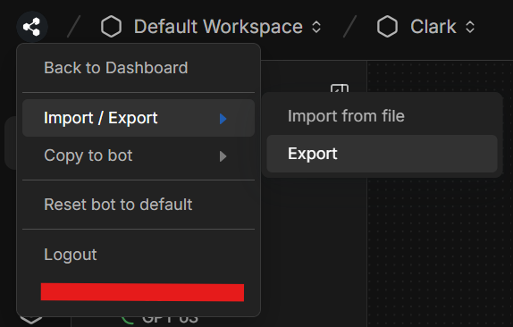
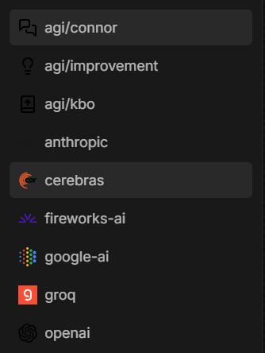

# Как да отворите Clark в Botpress Studio
За да отворите чатбота в Botpress ви трябва регистрация в платформата (тя е безплатна) и създаден чатбот, в който да заредите кода на бота ми оттук.

Избирате файла на чатбота и се зарежда, като трябва да се изтеглят следните интеграции:

Приятно разглеждане!